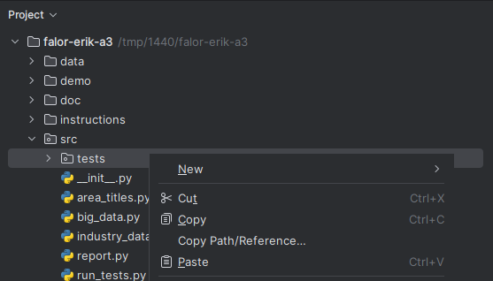
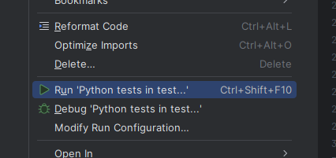
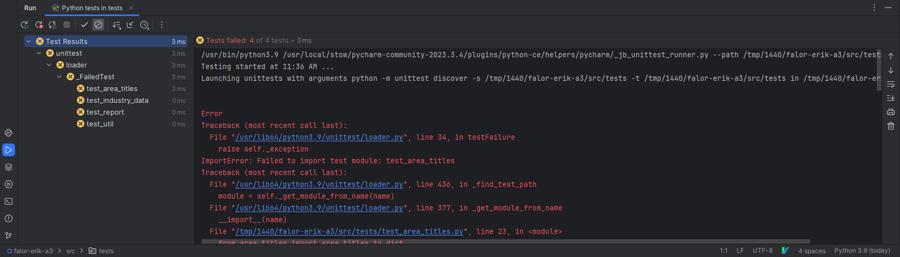
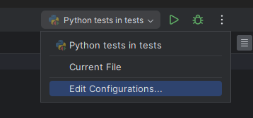
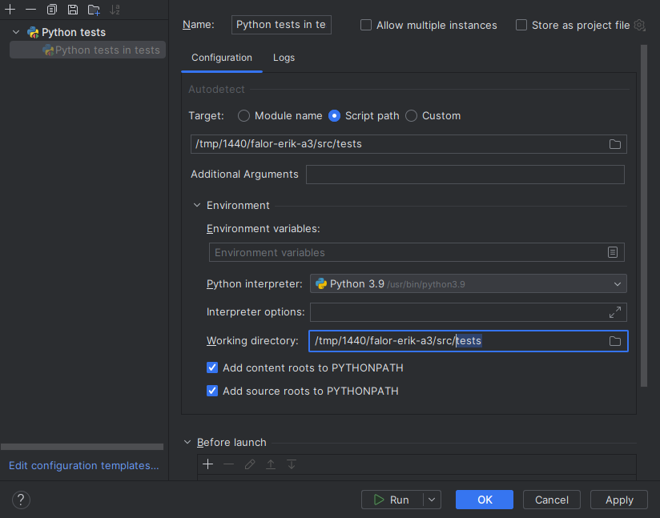
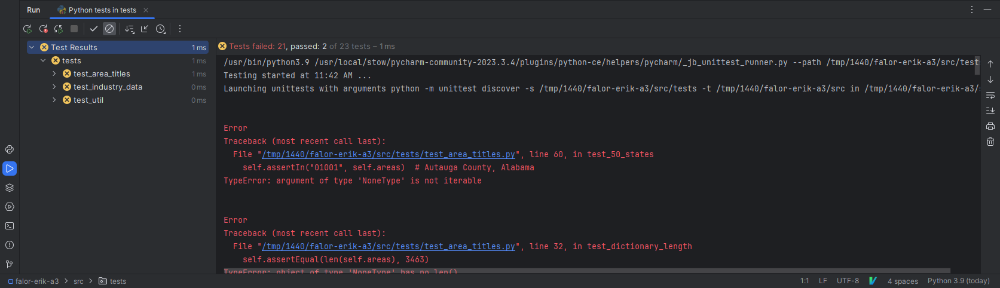
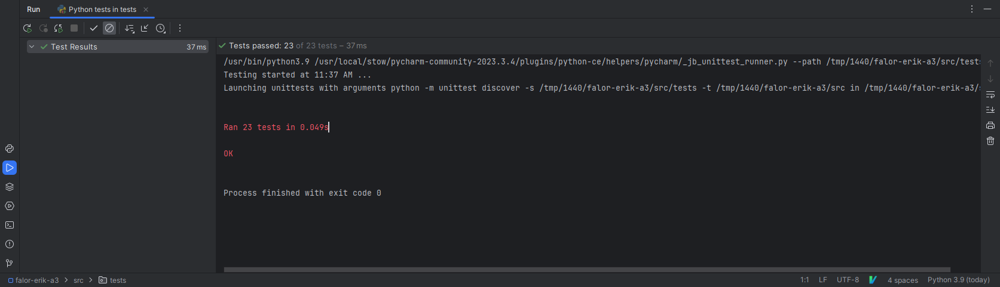

# CS 1440 Project 3: Big Data Processing - Running Unit Tests

The starter code consists of 25 test cases, 2 of which already pass.  You will increase the number of passing tests as you progress in the project.

*   [Running Unit Tests In PyCharm](#running-unit-tests-in-pycharm)
*   [Running All Tests From The Command Line](#running-all-tests-from-the-command-line)
*   [Running A Single Test Suite From The Command Line](#running-a-single-test-suite-from-the-command-line)
*   [Running An Individual Unit Test From The Command Line](#running-an-individual-unit-test-from-the-command-line)
*   [Interpreting Test Results](#interpreting-test-results)


## Running Unit Tests In PyCharm

A small amount of configuration is required to successfully run the unit tests in PyCharm.

0.  In the project explorer, right-click the **tests** folder:
    *   
1.  Click `Run 'Python tests in test...'`:
    *   
2.  Look in PyCharm's debugging pane at the bottom of the window; you should see that your tests failed because of `ImportError`
    *   Each failing test is represented by a yellow 'X'.  You can click on that icon to view the error message for that particular test.  At present, none of these messages are particularly helpful because all tests failed because of the same configuration problem.
    *   
3.  Go to the top of the screen and click the `Python tests in tests` run configuration dropdown, then click `Edit Configurations`:
    *   
4.  Locate **Working directory** and delete `/tests` from the end of the path
    *   
    *   Click `OK` to save your changes
5.  Re-run your tests through the green play button next to `Python tests in tests`.  Your tests should now fail for other reasons besides `ImportError`:
    *   
6.  As you implement more of the project, more tests will pass.  Eventually your test results will look like this:
    *   


## Running All Tests From The Command Line

You may run the entire set of unit tests through PyCharm or the shell.
The `run_tests.py` script is a convenient way to execute all of the tests in one go.

0.  `cd src`
1.  `python run_tests.py`;  this script produces a lot of output:
    *   ```bash
        $ cd src
        $ python run_tests.py
        test_50_states (tests.test_area_titles.TestAreaTitles.test_50_states)
        The areas dictionary contains FIPS codes representing all 50 states ... ERROR
        test_dictionary_length (tests.test_area_titles.TestAreaTitles.test_dictionary_length)
        The areas dictionary contains 3,463 pairs ... ERROR
        test_keylen_is_5 (tests.test_area_titles.TestAreaTitles.test_keylen_is_5)
        The areas dictionary contains no keys != len() of 5 ... ERROR

        ... dozens of lines snipped ...

        ======================================================================
        FAIL: test_record_matches_fips (tests.test_util.TestUtil.test_record_matches_fips)
        ----------------------------------------------------------------------
        Traceback (most recent call last):
          File "/home/fadein/3-Big_Data/starter/src/tests/test_util.py", line 63, in test_record_matches_fips
            self.assertTrue(record_matches_fips(self.all_ind_10_good, self.areas))
            ~~~~~~~~~~~~~~~^^^^^^^^^^^^^^^^^^^^^^^^^^^^^^^^^^^^^^^^^^^^^^^^^^^^^^^
        AssertionError: None is not true

        ----------------------------------------------------------------------
        Ran 25 tests in 0.005s

        FAILED (failures=7, errors=14)
        ```

The meaning of this output is explained in [Interpreting Test Results](#interpreting-test-results).


## Running A Single Test Suite From The Command Line

A *test suite* is a collection of test cases, related to a function or feature.

You can execute a single unit test suite.  Do this when you are focusing on just one part of the project and don't want to wade through unnecessary output.

The command to run a single suite is different than `run_tests.py`.

0.  `cd src`
1.  Run a command of this form, substituting the name of your desired test suite
    *   ```bash
        $ python -m unittest tests.test_util

        ... dozens of lines snipped ...

        ----------------------------------------------------------------------
        Ran 7 tests in 0.001s

        FAILED (failures=7)
        ```

| Argument       | Meaning
|----------------|---------------------------------------------------------------------------
| `-m unittest`  | Instruct Python to import the `unittest` module before running any more code
| `tests`        | The name of the directory containing unit test files
| `test_util`    | A Python source file's name, minus `.py`


## Running An Individual Unit Test From The Command Line

You can even focus on a single unit test:

0.  `cd src`
1.  Run a command of this form, substituting the name of your desired test case
    *   ```bash
        $ cd src
        $ python -m unittest tests.test_util.TestUtil.test_record_matches_fips
        F
        ======================================================================
        FAIL: test_record_matches_fips (tests.test_util.TestUtil.test_record_matches_fips)
        ----------------------------------------------------------------------
        Traceback (most recent call last):
          File "/home/fadein/3-Big_Data/starter/src/tests/test_util.py", line 63, in test_record_matches_fips
            self.assertTrue(record_matches_fips(self.all_ind_10_good, self.areas))
            ~~~~~~~~~~~~~~~^^^^^^^^^^^^^^^^^^^^^^^^^^^^^^^^^^^^^^^^^^^^^^^^^^^^^^^
        AssertionError: None is not true

        ----------------------------------------------------------------------
        Ran 1 test in 0.000s

        FAILED (failures=1)
        ```

| Argument                   | Meaning
|----------------------------|---------------------------------------------------------------------------
| `-m unittest`              | Instruct Python to import the `unittest` module before running any more code
| `tests`                    | The name of the directory containing unit test files
| `test_util`                | A Python source file's name, minus `.py`
| `TestUtil`                 | A class within the file `test_util.py`
| `test_record_matches_fips` | A unit test method within the class `TestUtil`


## Interpreting Test Results

As tests are executed, a progress report is generated. If tests fail, additional information is provided to clarify the nature of the failure. However, when multiple tests fail, this can result in a substantial amount of text, which may be overwhelming.

The provided starter code includes a total of 25 test cases. Out of these, 1 test passes successfully. Regarding the 24 tests that don't pass:

- 7 tests *fail*, indicating that these tests execute but do not produce the expected outcomes.
- 17 tests result in an *error*, suggesting that the code being tested encounters a crash during execution.

The outcomes of these tests are concisely summarized in the table below:

| Test Outcome | Number of Tests | Meaning
|--------------|-----------------|--------
| `ok`         | 1               | The test passed                                        
| `FAIL`       | 7               | The test finished, but the expected result was not observed 
| `ERROR`      | 17              | No output was produced because the code under test crashed 


### `ok` - A Passing Test

When a test succeeds, the output displays the name of the test method, the complete name of the module it resides in, and its docstring, all followed by `ok`.

```
test_str (tests.test_report.TestReport.test_str)
Report.__str__ returns a well-formatted report ... ok
```


### `FAIL` - A Failing Test

A failing test signifies that the code executed without crashing but did not produce the anticipated outcome. Upon completion of all tests, a summary highlighting the failure is presented, showing the specific line in the test file where the failure occurred, along with a description of the issue.

In this example the method `get_emplvl()` returned `None` instead of the expected value `1`:

```
======================================================================
FAIL: test_get_emplvl (tests.test_util.TestUtil.test_get_emplvl)
----------------------------------------------------------------------
Traceback (most recent call last):
  File "/home/fadein/3-Big_Data/starter/src/tests/test_util.py", line 43, in test_get_emplvl
    self.assertEqual(1, get_emplvl(self.all_ind_10_good))
    ~~~~~~~~~~~~~~~~^^^^^^^^^^^^^^^^^^^^^^^^^^^^^^^^^^^^^
AssertionError: 1 != None
```


### `ERROR` - A Crashing Test

A test may also end if it *unexpectedly* crashes (note: it is possible to design a test for a function that is *intended* to crash; for details, refer to the `unittest` documentation). If a test fails due to an error, the output will display the line number in the unit test where the crash occurred, followed by the specific piece of source code that triggered the crash.

In this example, a `for` loop is used to look at all keys in the `self.areas` dictionary.  However, `self.areas` is the value `None` instead of a dictionary:

```
======================================================================
ERROR: test_keylen_is_5 (tests.test_area_titles.TestAreaTitles.test_keylen_is_5)
The areas dictionary contains no keys != len() of 5
----------------------------------------------------------------------
Traceback (most recent call last):
  File "/home/fadein/3-Big_Data/starter/src/tests/test_area_titles.py", line 50, in test_keylen_is_5
    for key in self.areas:
               ^^^^^^^^^^
TypeError: 'NoneType' object is not iterable
```
